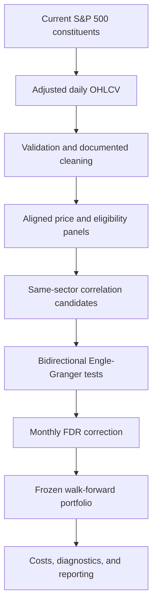

# S&P 500 Statistical Arbitrage Research

[](https://www.python.org/)
[](LICENSE)
[](reports/BASELINE_RESULTS.md)

A reproducible walk-forward study of whether same-sector S&P 500 pairs selected with correlation and cointegration exhibit economically meaningful out-of-sample mean reversion.

The project deliberately preserves its negative baseline result. Cointegration produced positive gross trading P&L, but the signal did not survive realistic execution and short-borrow costs.

## Result at a glance

| Metric | Frozen baseline |
|---|---:|
| Evaluation period | March 2001 to July 2026 |
| Securities | 503 current S&P 500 constituents |
| Completed trades | 165 |
| Gross trading P&L | +5.49% |
| Execution costs | -6.43% |
| Short-borrow costs | -2.06% |
| Net return | **-3.01%** |
| Annualized return | -0.12% |
| Sharpe ratio | -0.07 |
| Maximum drawdown | -6.50% |
| Win rate | 45.45% |
| Days invested | 15.73% |


The central result is not that mean reversion was absent. Forty-four trades exited through the mean-reversion rule and contributed +21.16% net P&L. However, stop-loss exits contributed -18.65%, qualification expiry contributed -5.27%, and implementation costs erased the remaining gross edge.

Read the full [baseline results report](reports/BASELINE_RESULTS.md) or the pre-result [backtest specification](BACKTEST_SPEC.md).

## Research question

> Does rolling cointegration add out-of-sample information beyond same-sector return correlation, and is that information strong enough to survive realistic implementation costs?

The current baseline answers the economic part of that question: not under the frozen portfolio rules and modeled costs. Milestone 2 will test the incremental-information question directly with a correlation-matched placebo.

## Research design



### Pair selection

- Same GICS sector
- 252-session formation window
- At least 200 overlapping return observations
- Minimum return correlation of 0.50
- Maximum 10 partners per security
- Maximum 20 tested candidates per sector and month
- Same-issuer share classes excluded using CIK
- Bidirectional Engle-Granger tests on log prices
- Conservative p-value: the larger p-value from the two regression directions
- Monthly Benjamini-Hochberg false-discovery-rate control at 10%
- Positive hedge ratio from 0.10 to 10.0
- Estimated half-life from 2 to 60 sessions

### Frozen trading rules

- Signal generated at the close; execution at the next available open
- First-touch entry when `2 <= |z| < 4`
- Mean-reversion exit when `|z| <= 0.5`
- Stop when `|z| >= 4`
- Maximum holding period of 20 sessions
- Close when the pair fails the next monthly qualification
- Maximum five simultaneous pairs
- Maximum one active pair per security
- Maximum 20% entry-time gross exposure per pair
- 10 basis points of one-way execution cost per traded leg
- 3% annualized short-borrow cost

All baseline decisions were documented in [BACKTEST_SPEC.md](BACKTEST_SPEC.md) before portfolio results were evaluated.

## What the baseline found

### Historical cointegration was rare

- 527,295 rolling candidate snapshots
- 135,543 bidirectional cointegration tests
- 298 qualified pair-months in the locked baseline
- 136 unique qualified pairs
- Only 105 of 306 selection months contained at least one qualified pair

### Out-of-sample convergence was unstable

The event study recorded 168 entry events:

- 33.3% reached `|z| <= 1.0`
- 23.2% reached `|z| <= 0.5`
- 14.9% crossed the fitted spread mean

### Trading frictions mattered more than the final headline suggests


Gross completed-trade P&L was positive, but execution costs exceeded it before borrow costs were included. This distinguishes a weak, expensive signal from a strategy with no observable mean-reversion effect.

### Relationship breakdown was the dominant failure mode


Profitable convergence and rapid breakdown coexisted. The next research stage tests whether cointegration adds information over correlation alone and whether stress regimes explain stop-outs without changing the frozen baseline.

## Repository structure

```text
.
|-- BACKTEST_SPEC.md
|-- config.py
|-- data/
|   |-- metadata/          # committed compact summaries and cleaning decisions
|   |-- raw/               # downloaded data; ignored
|   |-- processed/         # cleaned security files; ignored
|   |-- panels/            # aligned matrices; ignored
|   |-- research/          # large generated research files; ignored
|   `-- results/           # detailed backtest outputs; ignored
|-- reports/
|   |-- BASELINE_RESULTS.md
|   |-- figures/
|   `-- tables/
|-- scripts/
|   |-- download_constituents.py
|   |-- download_prices.py
|   |-- validate_data.py
|   |-- inspect_anomalies.py
|   |-- build_processed_data.py
|   |-- build_panels.py
|   |-- generate_candidates.py
|   |-- test_cointegration.py
|   |-- analyze_cointegration_sensitivity.py
|   |-- build_baseline_pairs.py
|   |-- run_spread_event.py
|   |-- run_baseline_backtest.py
|   `-- analyze_backtest.py
`-- requirements.txt
```

## Reproducing the study

### 1. Clone and create an environment

```bash
git clone https://github.com/Sirius-5107/sp500-statistical-arbitrage.git
cd sp500-statistical-arbitrage
python -m venv .venv
```

Activate it on Windows PowerShell:

```powershell
.\.venv\Scripts\Activate.ps1
```

Or on macOS/Linux:

```bash
source .venv/bin/activate
```

Install the dependencies:

```bash
python -m pip install --upgrade pip
pip install -r requirements.txt
```

### 2. Run the pipeline

```bash
python scripts/download_constituents.py
python scripts/download_prices.py
python scripts/validate_data.py
python scripts/inspect_anomalies.py
python scripts/build_processed_data.py
python scripts/build_panels.py
python scripts/generate_candidates.py
python scripts/test_cointegration.py
python scripts/analyze_cointegration_sensitivity.py
python scripts/build_baseline_pairs.py
python scripts/run_spread_event.py
python scripts/run_baseline_backtest.py
python scripts/analyze_backtest.py
```

Yahoo Finance data is downloaded locally and intentionally excluded from Git. Exact results may change when Yahoo revises historical adjusted data or when the present-day S&P 500 constituent list changes.

## Validation and research integrity

The baseline implementation passed the following checks:

- Trade P&L reconciles to final equity within floating-point tolerance
- Every entry executes strictly after its signal
- Every exit executes strictly after its exit signal
- No trade begins beyond the stop boundary
- No security appears in two simultaneous pairs
- The portfolio holds at most five active pairs

Additional safeguards include same-issuer exclusion, documented data overrides, monthly multiple-testing correction, deterministic signal ranking, next-open execution, realistic costs, and preservation of negative results.

## Limitations

- **Survivorship bias:** the universe uses current constituents rather than point-in-time S&P 500 membership.
- **Research-grade data:** Yahoo Finance is not an institutional point-in-time market-data source.
- **Simplified execution:** fixed costs replace security-specific bid-ask spread and market-impact models.
- **Borrow assumptions:** security-specific borrow fees and locate availability are not modeled.
- **Sparse sample:** only 165 completed baseline trades limit sector and subperiod inference.
- **No profitability claim:** this repository documents a research result, not a deployable strategy.

## Milestone 2

Planned experiments will remain separate from the frozen baseline:

1. Correlation-matched placebo pairs that failed cointegration qualification
2. Full predeclared cost and parameter sensitivity grids
3. Expanding-history market-stress filter
4. Breakdown-risk modeling only after the non-ML evidence is complete

The baseline will not be overwritten by later experiments, and full grids will be published without selecting only the best-performing cell.

## License

Released under the [MIT License](LICENSE).
