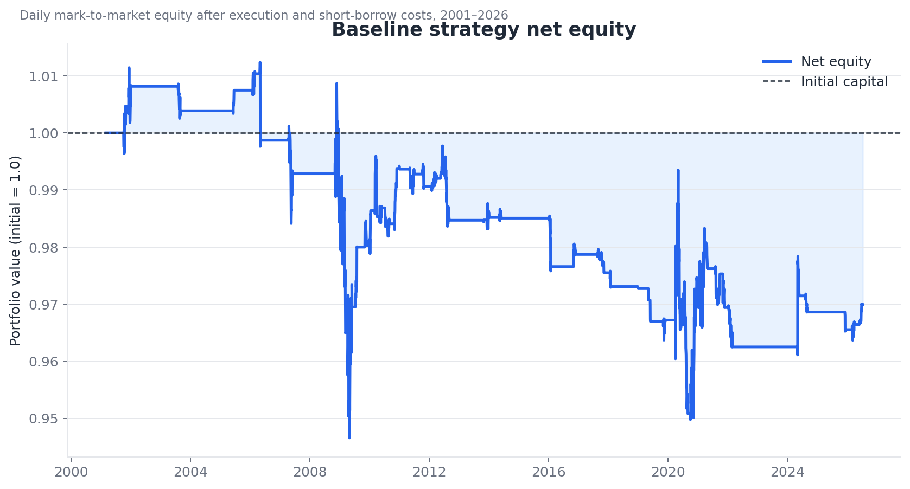
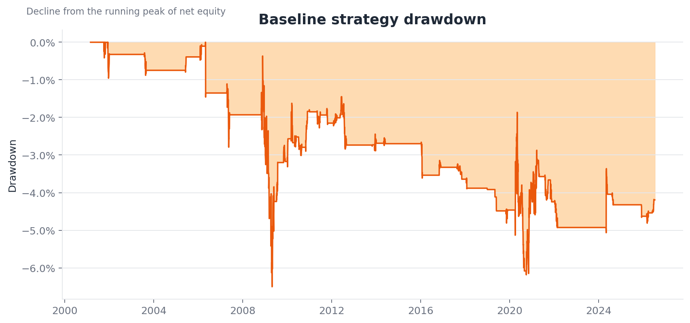
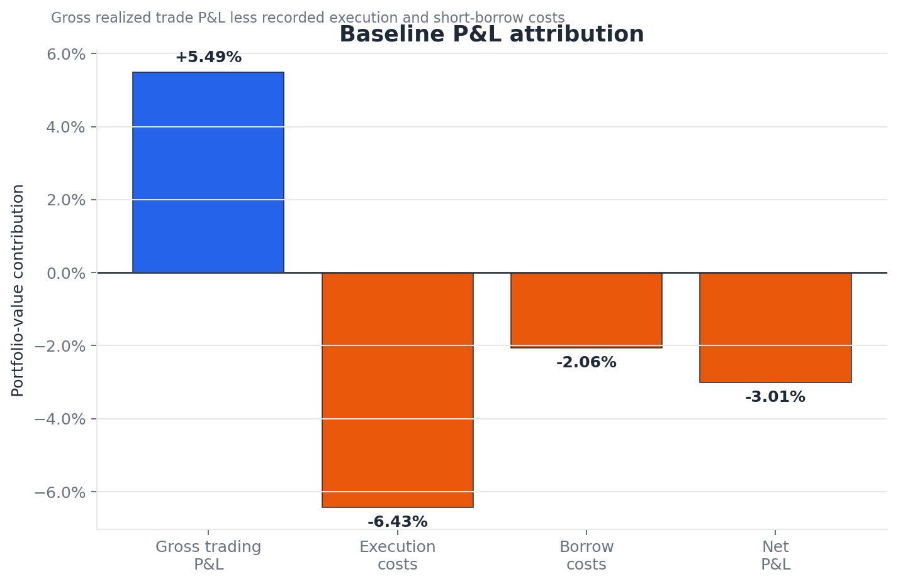
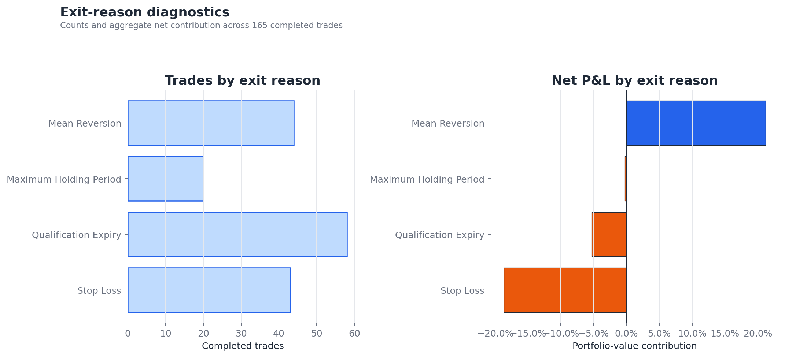
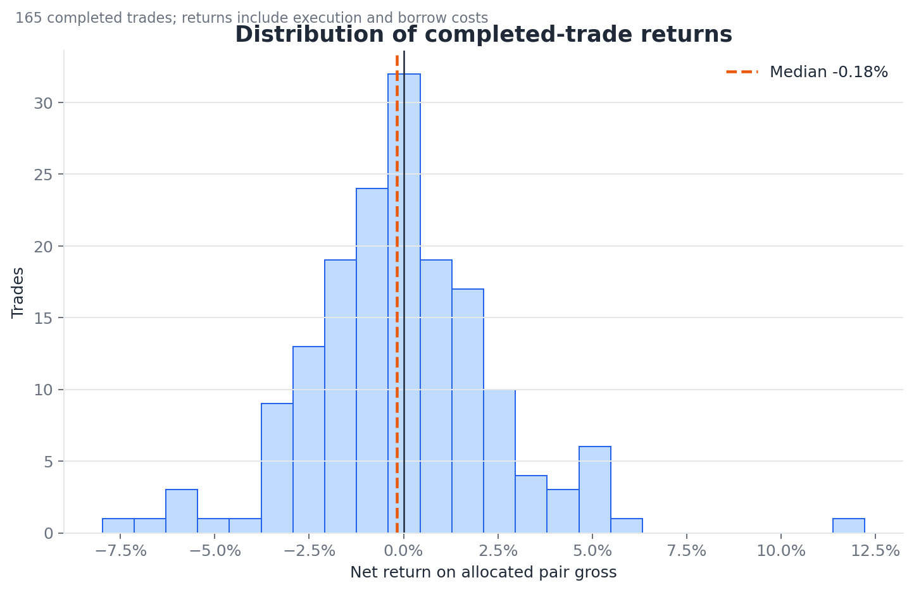
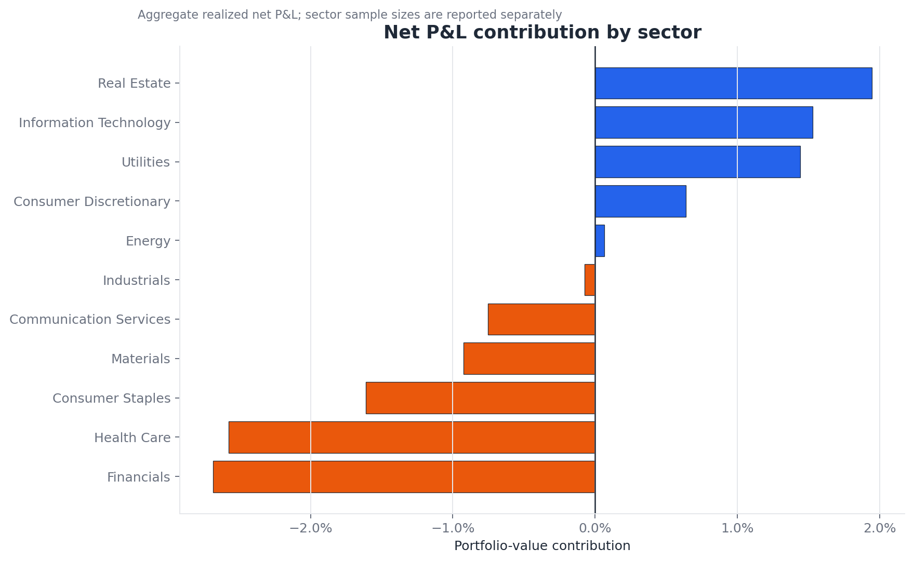
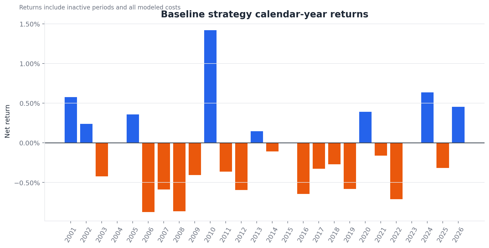
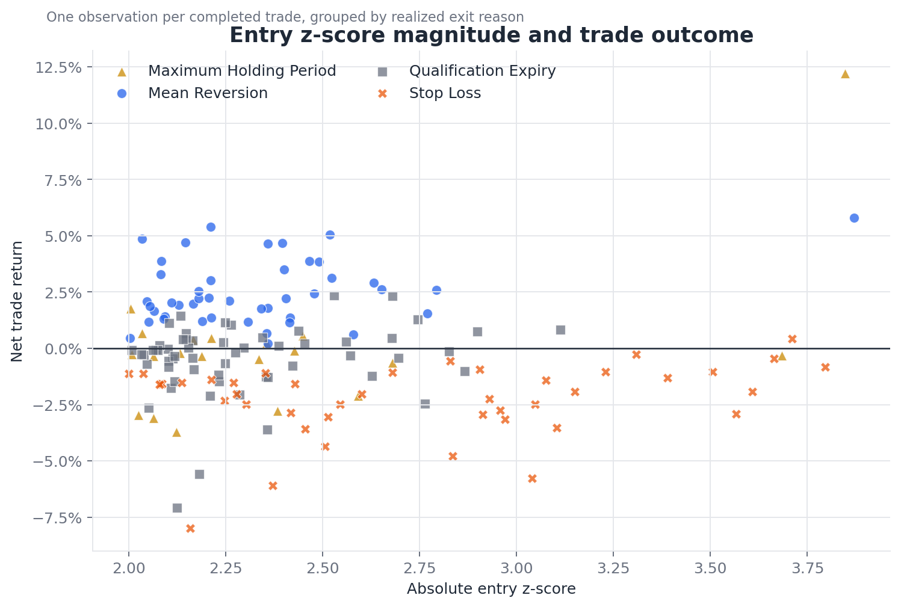
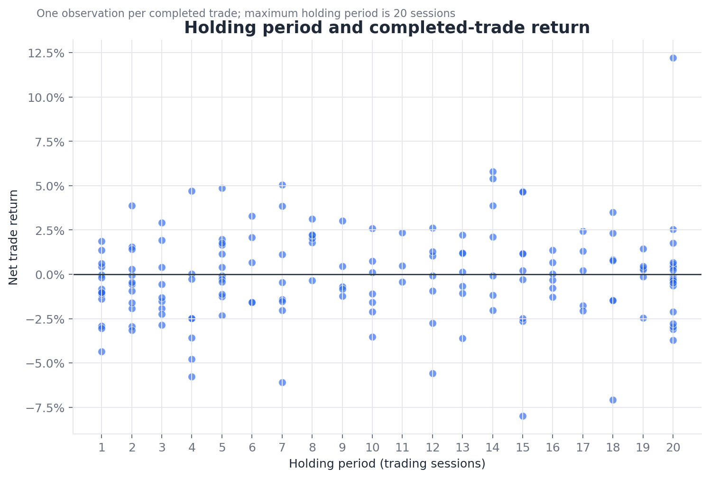

# Baseline Results: S&P 500 Statistical Arbitrage

## Technical summary

The frozen walk-forward pairs strategy generated **+5.49% in aggregate gross trading P&L**, but this was insufficient to overcome **6.43% in modeled execution costs** and **2.06% in short-borrow costs**. Net portfolio return was therefore **-3.01%** from March 2001 through July 2026, with a **-0.07 Sharpe ratio** and **-6.50% maximum drawdown**.

The negative result does not imply that the spreads never mean-reverted. Forty-four trades exited through the mean-reversion rule and contributed **+21.16% net P&L**. The principal failure mode was structural spread breakdown: 43 stop-loss exits contributed **-18.65%**, while qualification-expiry exits contributed another **-5.27%**. The baseline therefore identifies a weak but observable mean-reversion effect whose economic value is erased by tail losses and implementation frictions.

This result is intentionally retained as a negative baseline. No parameter was changed after observing portfolio performance.

| Metric | Baseline result |
|---|---:|
| Evaluation period | March 2001-July 2026 |
| Completed trades | 165 |
| Gross trading P&L | +5.49% |
| Execution costs | -6.43% |
| Short-borrow costs | -2.06% |
| Net total return | -3.01% |
| Annualized return | -0.12% |
| Sharpe ratio | -0.07 |
| Maximum drawdown | -6.50% |
| Win rate | 45.45% |
| Profit factor | 0.90 |
| Sessions with invested capital | 15.73% |

## A modest gross signal did not survive implementation costs

The strategy produced positive realized P&L before costs, but the margin was narrow. Execution costs alone exceeded gross trading P&L; borrow costs widened the final loss. This makes the result economically different from a strategy with no predictive signal: the central question is whether turnover, breakdown risk, or both can be reduced without data mining.

The equity curve is mostly flat because the strict selection process produced few qualified pairs and the portfolio was invested on only 15.73% of sessions. Losses accumulated episodically rather than through continuous market exposure.

Drawdowns were concentrated around periods of market and relationship instability, particularly around the global financial crisis and the COVID-era dislocation. This is descriptive evidence, not proof that a broad market-regime filter would improve performance.

The attribution is an accounting decomposition of completed trades. Gross trading P&L is measured before recorded costs; it is not a separately rerun zero-cost portfolio with independent position sizing.

## Spread convergence worked when it occurred, but breakdowns dominated

Mean-reversion exits were highly profitable by construction and contributed +21.16% across 44 trades. This was offset primarily by 43 stop-loss exits, which contributed -18.65%. Qualification expiry also hurt: 58 positions were closed because their pair no longer qualified at the monthly refresh, contributing -5.27%.

| Exit reason | Trades | Net P&L | Win rate | Median net return | Median holding period |
|---|---:|---:|---:|---:|---:|
| Mean reversion | 44 | +21.16% | 100.00% | +2.17% | 8 sessions |
| Maximum holding period | 20 | -0.25% | 35.00% | -0.29% | 20 sessions |
| Qualification expiry | 58 | -5.27% | 39.66% | -0.16% | 12 sessions |
| Stop loss | 43 | -18.65% | 2.33% | -1.92% | 4 sessions |

The asymmetry is the baseline's most important diagnostic result. Profitable convergence was common enough to create gross alpha, but failed relationships moved rapidly and produced losses large enough to erase it.

The median completed trade returned -0.18% after costs. The distribution includes a small number of large positive and negative outcomes, making aggregate performance sensitive to tail events. This motivates tests of breakdown prediction and regime conditioning, but does not justify selecting a filter after viewing these outcomes.

## Performance was concentrated by sector and year

Real Estate, Information Technology, and Utilities were the strongest contributors. Financials, Health Care, and Consumer Staples were the weakest.

| Sector | Trades | Net P&L | Win rate |
|---|---:|---:|---:|
| Real Estate | 41 | +1.95% | 56.10% |
| Information Technology | 5 | +1.53% | 60.00% |
| Utilities | 27 | +1.44% | 55.56% |
| Consumer Discretionary | 9 | +0.64% | 44.44% |
| Energy | 11 | +0.06% | 45.45% |
| Industrials | 18 | -0.07% | 50.00% |
| Communication Services | 6 | -0.75% | 16.67% |
| Materials | 14 | -0.92% | 50.00% |
| Consumer Staples | 10 | -1.61% | 30.00% |
| Health Care | 9 | -2.58% | 11.11% |
| Financials | 15 | -2.69% | 26.67% |

These sector rankings are descriptive and have unequal sample sizes. Information Technology, for example, contains only five trades; its apparent strength is therefore not sufficient evidence for a sector allocation rule.

The best calendar year was 2010 at +1.42%. Five Real Estate trades contributed approximately +1.34% based on their exit-year attribution, including pairs among apartment and diversified REITs. Publicly traded REITs were rebounding strongly after the financial crisis, but the strategy was market-neutral; the result should be interpreted as successful relative-price convergence within the sector, not as profit from a directional real-estate boom.

Calendar-year results were otherwise weak and sparse. Several years had no meaningful exposure, and no persistent multi-year performance regime is visible.

## Entry severity helped identify breakdown risk, but not reliably enough

Higher entry z-scores were increasingly associated with stop-loss exits. The corrected baseline forbids entry when the signal is already beyond the `|z| = 4` stop boundary and requires a spread to reset before another first-touch entry.

The relationship is useful diagnostically but cannot be converted into a new optimized entry threshold using this same sample. Entry thresholds of 1.5, 2.0, and 2.5 were predeclared as robustness checks; their results must be presented as a grid rather than selecting the best value.

Holding period alone does not show a clear monotonic relationship with return. A small number of profitable long-duration trades coexist with many positions that remained unresolved until expiry or the 20-session limit.

## Scope, data, and metric definitions

The study uses daily adjusted OHLCV data downloaded from Yahoo Finance for 503 securities in the current S&P 500 constituent list. The available panel runs from January 2000 through July 2026; the portfolio evaluation begins in March 2001 when the first tradable qualified pair becomes available.

The primary benchmark is cash at a 0% return because the strategy is designed to be approximately market-neutral. Net return includes modeled execution and borrow costs. Trade return is measured relative to the pair's gross capital allocation at entry.

The universe is **not point-in-time historical S&P 500 membership**. It contains current constituents projected backward when price history exists, creating survivorship bias. Results must not be interpreted as a fully investable historical S&P 500 simulation.

## Frozen baseline methodology

The complete pre-result specification is recorded in [`BACKTEST_SPEC.md`](../BACKTEST_SPEC.md). The main rules are:

1. Form same-sector candidates using 252 daily returns, at least 200 overlapping observations, and minimum correlation of 0.50.
2. Retain at most 10 partners per security and 20 candidates per sector.
3. Exclude multiple share classes belonging to the same issuer.
4. Run bidirectional Engle-Granger tests on log prices and use the conservative p-value.
5. Apply monthly Benjamini-Hochberg false-discovery-rate control at 10%.
6. Require a positive hedge ratio from 0.10 to 10.0 and estimated half-life from 2 to 60 sessions.
7. Generate signals at the close and execute at the next available open.
8. Enter on the first touch of `2 <= |z| < 4`, exit at `|z| <= 0.5`, stop at `|z| >= 4`, or close after 20 sessions or qualification expiry.
9. Hold at most five pairs, use no security in multiple simultaneous pairs, and allocate at most 20% entry-time gross exposure per pair.
10. Charge 10 basis points per traded leg transaction and 3% annualized short-borrow cost.

Position parameters are frozen at entry. Entry-time gross exposure is capped at 100%; closing-price exposure may drift above that level between executions because the baseline does not rebalance open positions.

## Validation results

All critical implementation checks passed:

| Validation check | Result |
|---|---:|
| Trade P&L reconciles to final equity | Pass; error below `3 x 10^-15` |
| Entry occurs strictly after signal | Pass |
| Exit occurs strictly after exit signal | Pass |
| No entry starts beyond stop boundary | Pass |
| No security appears in concurrent pairs | Pass |
| Maximum five active pairs | Pass |

The validation table is saved in [`validation_checks.csv`](tables/validation_checks.csv), and the calculations are reproduced by [`analyze_backtest.py`](../scripts/analyze_backtest.py).

## Limitations and uncertainty

- **Survivorship bias:** current constituents are used instead of point-in-time membership.
- **Data source:** Yahoo Finance is suitable for research but is not an institutional point-in-time market-data source.
- **Simplified execution:** the model uses fixed basis-point costs rather than security-, volatility-, and order-size-dependent bid-ask spreads and market impact.
- **Borrow assumptions:** short-borrow availability and security-specific borrow fees are not modeled.
- **Sparse sample:** only 165 completed trades occur over more than 25 years, limiting sector, subperiod, and machine-learning inference.
- **Selection uncertainty:** qualified pairs occur in a minority of months and cointegration relationships are unstable.
- **Multiple comparisons:** false-discovery-rate control reduces but does not eliminate data-mining risk.
- **No causal claim:** sector and market-period patterns are descriptive associations.
- **Exposure drift:** execution-time gross exposure is constrained, but market moves can take closing exposure modestly above 100%.

These limitations make the baseline suitable as a transparent research experiment, not as evidence of a deployable trading strategy.

## Recommended next steps

The baseline should remain unchanged. Follow-up work should be run as separately labeled experiments:

1. **Cost sensitivity:** rerun low, baseline, and stressed execution and borrow assumptions.
2. **Market-stress filter:** block new entries when SPY's trailing 20-session realized volatility exceeds its expanding historical 90th percentile; continue managing existing positions normally.
3. **Matched placebo:** compare qualified pairs with similar same-sector, correlation-matched pairs that failed cointegration qualification.
4. **Predeclared parameter grid:** report all entry, exit, stop, and formation-window cells without selecting a winner.
5. **Breakdown classification:** only after expanding the event sample, test whether pre-entry information predicts convergence versus stop-out using time-aware validation.

The most valuable next research question is not "which parameter makes the backtest positive?" It is:

> Does cointegration provide incremental out-of-sample information beyond sector membership and return correlation, and can relationship breakdown be detected without sacrificing the profitable convergence events?

## Further questions

- Does gross alpha survive under lower-turnover portfolio construction?
- Are stop losses concentrated in high-volatility market regimes after controlling for sector?
- How much of Real Estate and Utilities performance is explained by repeated exposure to a small number of pairs?
- Does the result persist with point-in-time index membership or a broader CRSP-style universe?
- Are qualification-expiry losses evidence of delayed model failure that should be incorporated into the signal rather than treated only as an administrative exit?

